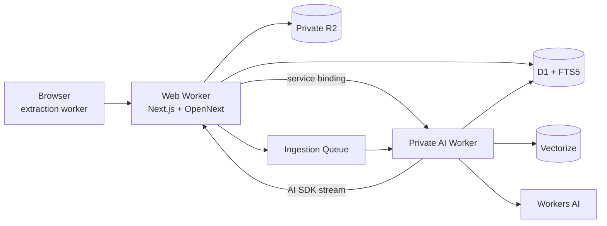

# Architecture

Kivo separates the public application from the CPU- and model-oriented data plane. `kivo-web` owns identity, authorization, quotas, uploads, user APIs, and administration. A Cloudflare service binding is the only ingress to `kivo-ai-worker`, which owns embeddings, hybrid retrieval, reranking, OCR, generation, and queue consumption.

Every tenant row carries `organization_id`; authorization happens before storage access and again before evidence enters a prompt. FTS is rebuildable derived data. R2 originals never become public. Queue payloads contain identifiers rather than document bodies.

## Retrieval

Kivo embeds a query with 1,024-dimensional BGE-M3, retrieves independently from Vectorize and FTS5, applies collection grants, fuses rankings using reciprocal-rank fusion, reranks candidates, and fits evidence into a bounded context. Generation follows an evidence-only instruction and emits durable document/version/chunk/page citations.

## ADRs

- ADR-001: Cloudflare-native persistence minimizes cost and network boundaries.
- ADR-002: client extraction keeps PDF/DOCX parsing outside Worker CPU allocations.
- ADR-003: two Workers keep AI bindings private and independently deployable.
- ADR-004: FTS5 is derived state; D1 rows and R2 originals are authoritative.
